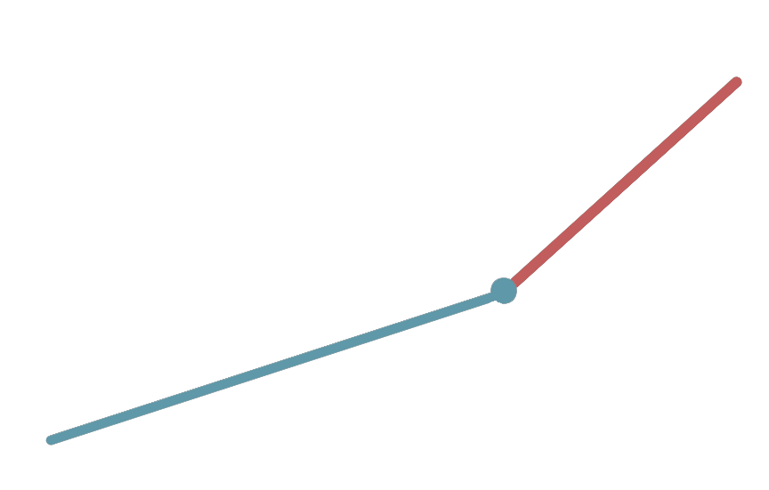

# Stopwatch task

## The task
Create a working stopwatch with minute and second hands using only CSS animations.
- The starting position of the hands should be at 0:00.
- Write all styles in `src/styles/main.scss`.
---

